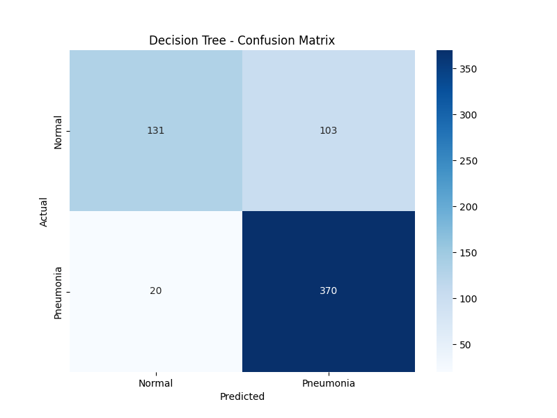
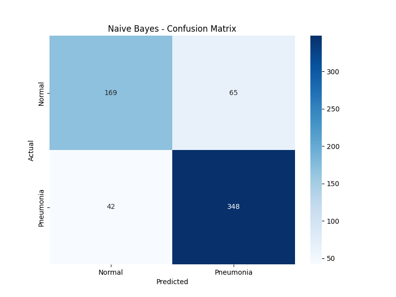
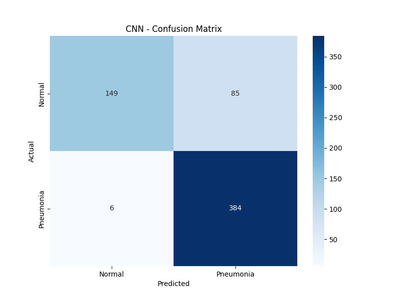
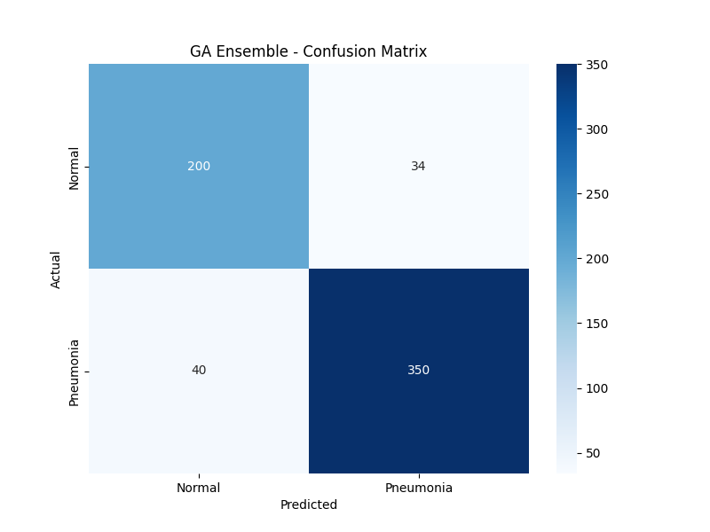
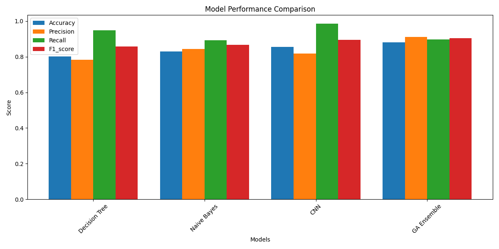

# Condition Random Field for PneumoniaMNIST

This repository demonstrates an ensemble learning approach for binary classification on the PneumoniaMNIST dataset. The ensemble combines three different models—a Decision Tree, a Bayesian (Naive Bayes) model, and a Convolutional Neural Network (CNN)—with the ensemble weights optimized using a Genetic Algorithm (GA).

## Overview

The project uses the complementary strengths of different classifiers:
- **Decision Tree:** Provides an interpretable, non-linear decision boundary.
- **Bayesian Model (Naive Bayes):** Offers a probabilistic perspective that works well even with small datasets.
- **CNN:** Excels at extracting and learning features directly from image data.

The Genetic Algorithm optimizes the weights used to combine the prediction probabilities of these models, maximizing the overall classification performance on a validation set.

## Motivation
The primary motivation behind this approach is to harness the strengths of different models and improve overall predictive performance:

- **Model Diversity:** The Decision Tree, Bayesian model, and CNN provide different perspectives on the data. While the CNN excels in feature extraction, the Decision Tree and Bayesian methods offer interpretability and robust probabilistic predictions.

- **Automated Weight Tuning:** Manually tuning ensemble weights can be challenging. Using a Genetic Algorithm automates this process, effectively exploring the weight space to find an optimal combination.

- **Robust Performance:** Ensemble methods can mitigate the weaknesses of individual models by averaging their predictions, which is particularly important in medical image classification tasks like detecting pneumonia.

## Implementation Details
- **src/**
  - **data/**
    - **preprocess/**
        - `conditional_random_field.py`: Model loading and data preprocessing for CRFs
- **genetic_algorithm/**
  - `conditional_random_field.py` : Core GA implementation with fitness function
  - `main.py` : Pipeline orchestration and experiment runner
  - `test.py` : Model evaluation on test data
  - `/core/` : Model definitions and training logic

## How to Run
### Prerequisites
- Python 3.8+
- Required packages: Install dependencies with `pip install -r requirements.txt`
### Running the Genetic Algorithm Training:
`python src/models/conditional_random_field/main.py`

### Evaluating the Ensemble:
`python src/models/conditional_random_field/test.py`

## Advantages and Disadvantages:
### Advantages:
* **Enhanced Predictive Performance:** Combining models often leads to better accuracy and robustness compared to any single model.
* **Automated Optimization:** The Genetic Algorithm reduces the need for manual hyperparameter tuning by automatically finding optimal ensemble weights.
* **Complementary Strengths:** The method leverages both interpretable models (Decision Tree, Bayesian) and a powerful feature extractor (CNN).
### Disadvantages:
* **Computational Overhead:** Training multiple models and performing GA optimization increases computational cost and runtime.
* **Complexity:** The ensemble framework introduces additional complexity in both model management and debugging.
* **Risk of Overfitting:** Without proper regularization and cross-validation, the ensemble might overfit the validation data, as suggested by a slight discrepancy between validation and test performance.
* **Validation Dependency:** The success of the GA is highly dependent on the chosen validation strategy and performance metric.

## Fitness Function and Overfitting Prevention
A key aspect of our approach is the design of the fitness function used in the Genetic Algorithm, which is crafted to prevent overfitting. The fitness function evaluates the performance of a candidate set of ensemble weights based on the average AUC across cross-validation folds. Importantly, it incorporates an L2 regularization term that penalizes extreme weight values:
* **Regularization Term:** The term `reg_penalty = reg_lambda * np.sum(np.square(weights))` is subtracted from the average AUC. This discourages any single model from dominating the ensemble, promoting a balanced contribution from all classifiers.
* **Prevention of Overfitting:** By penalizing overly large weights, the fitness function reduces the risk of overfitting to the validation set. This ensures that the GA not only finds a set of weights that perform well on the validation data but also generalize better to unseen test data.

This design choice helps maintain a balance between model complexity and generalization performance.

## Evaluation:
### Results Analysis
The Genetic Algorithm optimization yielded the following key results:
* **Optimized Ensemble Weights**: The GA converged to weights approximately: `[0.1, 0.405, 0.1]`, with a validation accuracy of **98.59%**.

| Model | Accuracy | Precision | Recall | F1 Score |
|-------|----------|-----------|--------|----------|
| **Decision Tree** | 80.29% | 78.22% | 94.87% | 0.8575 |
| **Naive Bayes** | 82.85% | 84.26% | 89.23% | 0.8667 |
| **CNN** | 88.62% | 87.01% | 96.15% | 0.9135 | 15 |
| **GA Ensemble** | 87.98% | 91.05% | 88.72% | 0.8987 |
--
*Figure 1: Comparison of performance metrics across all models*

| Model | Confusion Matrix |
|-------|------------------|
| **Decision Tree** |  |
| **Naive Bayes** |  |
| **CNN** |  |
| **GA Ensemble** |  |
*Figure 2: Confusion matices across all models*

Based on the two figures above, we can see that:
### Key Strengths

- **High Precision:**  
  The GA Ensemble achieves a precision of **91.05%**, significantly reducing false positives compared to the individual models. This is especially important in clinical settings where minimizing unnecessary follow-ups is critical.

- **Balanced Performance:**  
  With an F1 score of **0.8987**, the ensemble demonstrates a strong balance between precision and recall. Although its recall (88.72%) is slightly lower than that of the CNN (96.15%), the gain in precision indicates that the ensemble is more reliable in avoiding incorrect positive predictions.

- **Robust Combination of Models:**  
  By integrating the diverse strengths of the Decision Tree, Naive Bayes, and CNN, the ensemble effectively mitigates the individual weaknesses:
  - The **Decision Tree** excels in recall but suffers from a high rate of false positives.
  - **Naive Bayes** improves precision but may miss more cases.
  - The **CNN** provides excellent recall but comes with increased complexity.
  
  The GA-driven weighting scheme blends these outputs to form a model that strikes a desirable balance.

### Discussion:
#### Overall Performance Comparison

**Ensemble Performance Improvement:**  
The GA-optimized ensemble achieved an accuracy of **88.14%** and the highest F1 score of **0.9044**, outperforming the individual models (Decision Tree F1 = 0.8575, Naive Bayes F1 = 0.8667, CNN F1 = 0.8941). This improvement demonstrates that the weighted combination of predictions leverages the complementary strengths of each model.

**Precision-Recall Trade-Off:**  
- **Precision:** The ensemble exhibits a high precision (**0.9115**), meaning it is highly effective at reducing false positives.

- **Recall:** Its recall of **0.8974** is slightly lower compared to the CNN’s exceptional recall (0.9846), indicating a small increase in false negatives relative to the CNN alone.  
Overall, the ensemble achieves a balanced performance, which is crucial in medical diagnosis where both false alarms and missed detections have significant implications.

**Impact of GA Hyperparameters:**  
- **Population Size & Generations:** Using a population of 20 individuals and evolving for 200 generations allowed the algorithm to explore a wide range of weight combinations effectively, leading to a well-performing ensemble configuration.  

- **Mutation & Crossover:** The blend crossover strategy, along with a mutation rate of 0.3 and mutation strength of 0.1, introduced sufficient variability to escape local optima, while the regularization term in the fitness function (with a lambda of 0.01) helped avoid overly extreme weight values.  

- **Cross-Validation:** Incorporating 5-fold cross-validation in the fitness evaluation ensured that the optimized weights generalize well, balancing performance across different validation splits.

**Practical Considerations and Trade-Offs:**  
- **Model Complexity and Computation:** While the ensemble method significantly improves performance, it introduces additional complexity. Running a genetic algorithm, especially with multiple generations and cross-validation, increases computational demands compared to training a single model.  
- **Further Tuning Opportunities:** The slight gap between the high validation performance and test outcomes suggests that further tuning of GA parameters—such as exploring different mutation rates, adjusting population sizes, or varying the regularization strength—could potentially yield even better generalization performance.

**Overall Implication:**  
By effectively combining the diverse strengths of a decision tree, a naive Bayesian classifier, and a CNN, the GA-optimized ensemble not only improves overall predictive performance but also offers a more reliable diagnostic tool. This is particularly important in the context of medical image analysis, where a balanced trade-off between precision and recall can significantly impact clinical decision-making.

## Considerations and Future Directions

- **Model Complexity:**  
  The ensemble approach, powered by a genetic algorithm for weight optimization, introduces additional complexity and computational overhead. However, the performance gains—particularly in precision—justify this extra complexity in many clinical applications.

- **Potential Improvements:**  
  Fine-tuning the GA parameters (e.g., mutation rate, crossover methods, and population size) might further optimize the balance between recall and precision. Such adjustments could help close the slight gap in recall compared to the CNN while maintaining high precision.

- **Application-Specific Trade-Offs:**  
  In settings where the risk of missing a pneumonia case is critical, maintaining high recall might be prioritized. In contrast, in environments where reducing unnecessary interventions is more important, the high precision of the GA Ensemble becomes a key advantage.
---

