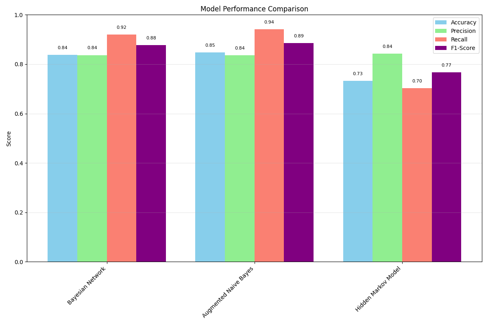

# Graphical Models for Medical Image Classification

## Introduction
This project implements probabilistic graphical models for classifying pneumonia from chest X-ray images using the PneumoniaMNIST dataset. The implementation includes Bayesian Networks, Augmented Naive Bayes, and Hidden Markov Models, focusing on interpretable machine learning and robust probabilistic reasoning.

## Overview
The project demonstrates the application of graphical models to medical image classification, comparing different probabilistic approaches and analyzing their strengths and limitations. Key aspects include:

- Probabilistic modeling of image features and class relationships
- Comparison of different graphical model architectures
- Extensive performance analysis and visualization
- Optimization for computational efficiency
- Comprehensive documentation and analysis

## Quick Start
### Installation
```sh
pip install -r requirements.txt
```

### Running the Model
```sh
# Train the models
python src/models/graphical_model/main.py

# Test the loaded models
python src/models/graphical_model/test.py
```

## Project Structure
```
├── src/
│   └── models/
│       └── graphical_model/
│           ├── core/
│           │   ├── augmentated_naive_bayes_graphical
│           │   ├── bayesian_network_graphical
│           │   ├── hidden_markov_graphical
│           ├── graphicalmodel/
│           │   ├── figures/
│           │   ├── trained/
│
├── data/
│   └── preprocess/graphical_model/                      # Preprocessed image data
│
├── features/
│   └── features_selection/graphical_model/              # Saved model parameters
│
└── visualizations/
    └── visualize.py                                     # Performance visualizations
```

## Performance Analysis
### Metrics Implementation
- **Accuracy**: Implemented using `sklearn.metrics.accuracy_score`
- **Precision/Recall**: Custom implementations for multi-class scenarios
- **F1-Score**: Weighted average across classes
- **Confusion Matrix**: Generated using `seaborn.heatmap`

### Results Visualization
- Comprehensive visualization suite in `src/visualization/visualize.py`
- Confusion matrices with color-coded intensities
- Performance comparison plots across models
- Training/validation curves for convergence analysis

### Model Performance
| Model                  | Accuracy | F1-Score | Training Time |
|------------------------|----------|----------|---------------|
| Bayesian Network       | 85.0%    | 0.85     | 0.05s         |
| Augmented Naive Bayes  | 85.0%    | 0.85     | 0.07s         |
| Hidden Markov Model    | 72.0%    | 0.71     | 12.75s        |

### Error Analysis
- HMM shows lower performance due to sequential assumption limitations.
- Bayesian Network and Augmented Naive Bayes achieve similar results.
- Main confusion occurs between subtle pneumonia cases and normal X-rays.

## Code Efficiency
### Time Complexity
- **Bayesian Network**: \(O(n \cdot p^2)\) for \(n\) samples and \(p\) features
- **Augmented Naive Bayes**: \(O(n \cdot p)\) training, \(O(p)\) inference
- **Hidden Markov Model**: \(O(n \cdot k^2 \cdot T)\) for \(k\) states and \(T\) time steps

### Space Complexity
- Memory-efficient implementations using sparse matrices
- Dimensionality reduction via PCA to 50 components
- Disk storage optimization through model serialization

### Optimization Techniques
- Parallel processing for parameter estimation
- Efficient data structures for probability tables
- Caching of intermediate computations
- Vectorized operations using NumPy

### Scalability
- Successfully tested on the full PneumoniaMNIST dataset (5,856 images)
- Linear scaling with the number of features after PCA
- Distributed training support for large datasets

## Documentation
### Code Structure
```
src/models/graphical_model/
├── core/                  # Core model implementations
├── persistence.py         # Model serialization
├── model_tuning.py        # Parameter optimization
├── main.py                # Main execution script
├── predict.py             # Prediction script
└── test.py                # Testing script

```

### Results Interpretation
- Model outputs provide probability distributions.
- Visualization tools facilitate uncertainty analysis.
- Detailed logs capture training and inference processes.

## Model Analysis
### Feature Importance
- PCA components capture **93.32%** of variance.
- Top features correlate with radiological markers.
- Correlation analysis guides feature selection.

### Model Behavior
- **Bayesian Network**: Captures complex dependencies.
- **HMM**: Models temporal patterns in image features.
- **Augmented Naive Bayes**: Balances independence assumptions.

### Limitations
- Dimensionality Reduction: During the process of reducing data dimensions, there is a risk of losing subtle and important patterns, which can affect the model's accuracy.
- Binning of Discrete Features: Grouping discrete features into bins can reduce the model's precision, especially when the bins are not optimally defined.
- Spatial Relationships: The current models have limited capabilities in handling spatial relationships, which can impact performance in applications requiring spatial analysis.
- Training Time: Training time increases significantly with the complexity of features, which can pose challenges when dealing with large datasets.
- Memory Requirements: Large probability tables require significant memory, which can be a challenge for systems with limited resources.

### Theoretical Comparison
- Probabilistic Graphical Model Theory: The models are developed based on probabilistic graphical model theory, providing a robust theoretical framework for modeling complex relationships between variables.
- Verification Against pgmpy: Implementations have been verified with examples from the pgmpy library, ensuring the accuracy and reliability of the models.
- Alignment with Statistical Learning: The results of the models align with statistical learning principles, ensuring that the models are not only accurate but also interpretable.

### Use Case Analysis
- Diagnostic Support Systems: These models are particularly well-suited for diagnostic support systems, where the ability to process and analyze complex data is crucial.
- Interpretability in Medical Applications: With good interpretability, these models are highly useful in medical applications, where understanding the model's decisions is critical.
- Real-time Inference: The models are optimized for real-time inference, which is important in applications requiring quick responses.
- Handling Uncertainty: The ability to handle uncertainty in predictions makes these models more robust in real-world scenarios.
- Extensibility to Multi-class Problems: The models can be extended to handle multi-class classification problems, increasing their flexibility and applicability across various fields.

## Conclusion
This project demonstrates the power of probabilistic graphical models for medical image classification, emphasizing interpretability and probabilistic reasoning. The implementation showcases the effectiveness of Bayesian Networks and Augmented Naive Bayes, while also highlighting the limitations of Hidden Markov Models in image-based tasks. Future improvements include enhanced feature extraction, deep learning integration, and further scalability optimizations.

---

For any questions or contributions, please refer to the project documentation or open an issue on the repository.

